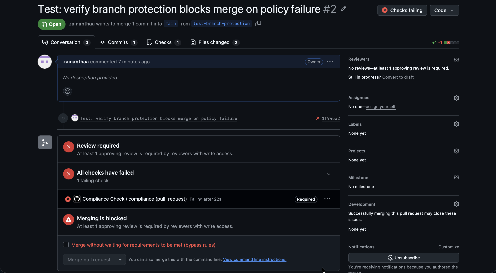
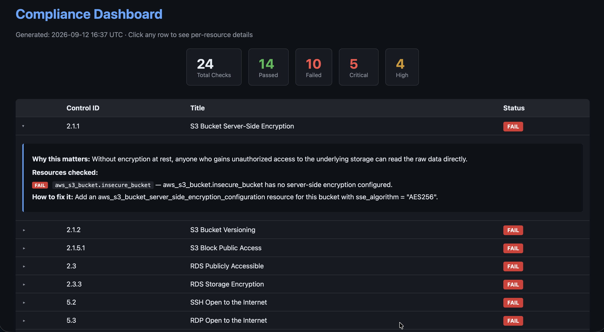

# Compliance-as-Code Pipeline


A GitHub Actions pipeline that automatically checks Terraform infrastructure against real [CIS AWS Foundations Benchmark](https://www.cisecurity.org/benchmark/amazon_web_services) controls **before** it can be merged — blocking the pull request if a control is violated, and generating a human-readable compliance report and interactive dashboard.

> **Note on the badge above:** it shows **failing**, on purpose. The `main` branch intentionally includes both compliant and non-compliant demo infrastructure (a public S3 bucket next to a private one, an SSH port open to the internet next to a locked-down one, a hardcoded database password next to a securely-sourced one) so the pipeline has real, concrete violations to catch. The red badge is proof the enforcement actually works — see [Live Demo](#live-demo) below for a real pull request this pipeline blocked.

## The Problem

Compliance checks in most organizations happen too late — a security team manually reviews infrastructure changes after the fact, or a scanner runs periodically and finds issues after they're already deployed. This project takes the opposite approach: compliance rules are written **as code**, evaluated **automatically**, and enforced **before** infrastructure can ever be merged or deployed.

## How It Works

Terraform (.tf)
→ terraform plan
→ JSON plan output
→ Conftest evaluates Rego policies against the plan
→ Python generates a Markdown report + interactive HTML dashboard
→ GitHub Actions fails the check if any control is violated
→ Branch protection blocks the merge


Every step runs automatically in GitHub Actions on every pull request, using **OIDC federation** to authenticate to AWS — no long-lived AWS credentials are stored anywhere in this repository or in GitHub Secrets for the AWS role itself.

Each control is checked against **every applicable resource in the plan**, not just reported as a single pass/fail — so a control can show, for example, one failing resource and one passing resource side by side, with the specific reason and remediation for the one that failed.

## Controls Checked

| Control ID | Title | Severity |
|---|---|---|
| 2.1.1 | S3 Bucket Server-Side Encryption | High |
| 2.1.2 | S3 Bucket Versioning | Medium |
| 2.1.5.1 | S3 Block Public Access | Critical |
| 2.3 | RDS Publicly Accessible | Critical |
| 2.3.3 | RDS Storage Encryption | High |
| 5.2 | SSH Open to the Internet | Critical |
| 5.3 | RDP Open to the Internet | Critical |
| EBS-1 | EBS Volume Encryption | High |
| IAM-1 | IAM Wildcard Policy (`Action: "*"`, `Resource: "*"`) | High |
| SECRET-1 | Hardcoded Credentials in Terraform Source | Critical |

Controls prefixed with a number (e.g. `2.1.1`, `5.2`) map directly to the CIS AWS Foundations Benchmark. `EBS-1`, `IAM-1`, and `SECRET-1` are additional security best-practice checks not tied to a specific CIS control number.

Every `terraform/main.tf` resource has a matching **compliant** and **insecure** version, so the pipeline has real, concrete violations to catch — this isn't a toy example, every check runs against a real (though intentionally imperfect) `terraform plan`.

## Live Demo

A real pull request, blocked by this pipeline because a required check failed:



The interactive compliance dashboard for the current state of `main` — click any control to see exactly which resource failed, why, and how to fix it:



## Tech Stack

| Purpose | Tool |
|---|---|
| Infrastructure as Code | Terraform |
| Policy engine | Open Policy Agent (OPA) + Rego |
| CI enforcement | Conftest + GitHub Actions |
| AWS authentication | OIDC federation (no stored credentials) |
| Framework reference | CIS AWS Foundations Benchmark |
| Reporting | Python (Markdown report + interactive HTML dashboard) |

## Repository Structure

compliance-as-code-pipeline/
├── terraform/ # Demo infrastructure (compliant + intentionally insecure)
├── policy/cis-aws/ # Rego policies, one file per AWS resource area
├── scripts/
│ ├── compliance_data.py # Shared logic: runs Conftest, reads the plan, builds pass/fail data
│ ├── generate_report.py # Builds the Markdown report, sets CI pass/fail
│ └── generate_dashboard.py # Builds the interactive HTML dashboard
└── .github/workflows/
└── compliance.yml # The CI pipeline itself


## Running Locally

Requires: [Terraform](https://developer.hashicorp.com/terraform/install), [OPA](https://www.openpolicyagent.org/docs/latest/#running-opa), [Conftest](https://www.conftest.dev/install/), Python 3, and AWS credentials with S3/RDS/IAM/EBS read access.

```bash
cd terraform
terraform init
terraform plan -out=tfplan.binary
terraform show -json tfplan.binary > tfplan.json
cd ..

python3 scripts/generate_report.py       # → compliance-report.md, sets exit code
python3 scripts/generate_dashboard.py    # → dashboard.html
```

## What's Next

- **Expanding resources** — IAM password policy, CloudTrail logging, EC2 unnecessary public IPs, KMS key rotation — additional CIS controls planned
- OSCAL-formatted output (NIST's machine-readable compliance standard)
- Multi-cloud policies (Azure/GCP) to demonstrate cross-cloud policy design

## Why This Project

Real compliance and security review in most organizations is manual, slow, and inconsistent. This project demonstrates translating actual regulatory/security requirements (CIS AWS Foundations Benchmark) into automated, enforceable code — and wiring that enforcement directly into the deployment pipeline itself, using the same OIDC-based, credential-free authentication pattern used in production CI/CD systems.