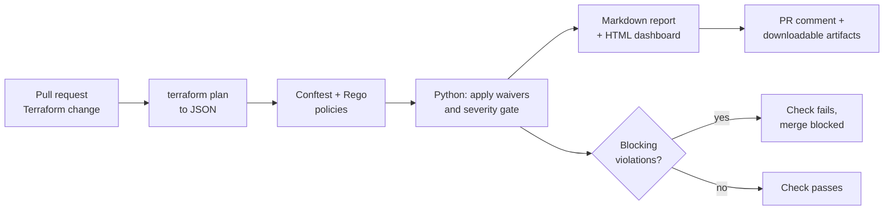

# Compliance-as-Code Pipeline


A GitHub Actions pipeline that checks Terraform infrastructure against security and compliance controls **before** it can be merged. If a control is violated, the pull request is blocked, and a human-readable report and an interactive dashboard explain exactly what failed, why it matters, and how to fix it.

> **About the red badge:** it is meant to fail. `main` intentionally contains compliant and non-compliant demo infrastructure side by side (a public S3 bucket next to a private one, SSH open to the internet next to a locked-down rule, a hardcoded database password next to a securely sourced one) so the pipeline has real violations to catch. See the [live demo](#live-demo).

## The problem

Compliance checks in most organizations happen too late: a security team reviews infrastructure by hand after the change, or a scanner runs periodically and finds issues after they are already deployed. This project takes the opposite approach. Rules are written **as code**, evaluated **automatically**, and enforced **before** anything is merged or deployed.

## How it works



1. Terraform produces a **plan**, converted to JSON. Nothing is deployed.
2. **Conftest** evaluates the Rego policies against that plan. Every control is checked against *every applicable resource*, not reported as a single pass/fail.
3. Python applies the **severity gate** and any approved **waivers**, then writes the report and dashboard.
4. The workflow **fails** if anything blocking remains, and branch protection stops the merge.

The workflow authenticates to AWS with **OIDC federation**, so no long-lived AWS keys are stored in the repository or in GitHub secrets. Third-party actions are pinned to commit SHAs, and the Conftest download is verified against a SHA-256 checksum.

## Controls checked

| Control | Title | Severity | CIS AWS v5.0.0 | NIST 800-53 Rev 5 | ISO 27001:2022 |
|---|---|---|---|---|---|
| S3-ENC-1 | S3 server-side encryption | High | none | SC-13, SC-28 | A.8.24 |
| S3-VER-1 | S3 versioning (must be `Enabled`) | Medium | none | CP-6, CP-9, CP-10 | A.8.13 |
| 2.1.4 | S3 Block Public Access (all four settings) | Critical | 2.1.4 | AC-3, AC-4, AC-6, SC-7 | A.5.15, A.8.3 |
| 2.2.1 | RDS storage encryption | High | 2.2.1 | SC-13, SC-28 | A.8.24 |
| 2.2.3 | RDS publicly accessible | Critical | 2.2.3 | AC-4, SC-7 | A.8.20, A.8.22 |
| 5.3 | SSH/RDP open to the internet, IPv4 (`0.0.0.0/0`) | Critical | 5.3 | AC-4, CM-7, SC-7 | A.8.20, A.8.22 |
| 5.4 | SSH/RDP open to the internet, IPv6 (`::/0`) | Critical | 5.4 | AC-4, CM-7, SC-7 | A.8.20, A.8.22 |
| EBS-1 | EBS volume encryption | High | 5.1.1 (related) | SC-13, SC-28 | A.8.24 |
| IAM-1 | IAM wildcard policy (`Action: "*"` on `Resource: "*"`) | High | 1.15 (related) | AC-2, AC-3, AC-5, AC-6 | A.5.15, A.8.2 |
| SECRET-1 | Hardcoded credentials in Terraform source | Critical | none | IA-5, IA-5(7) | A.5.17, A.8.4 |

**Control IDs follow one rule.** A numeric ID (`2.1.4`, `2.2.1`, `2.2.3`, `5.3`, `5.4`) is the real recommendation number from the [CIS AWS Foundations Benchmark v5.0.0](https://www.cisecurity.org/benchmark/amazon_web_services), used only where the check is a direct match. An ID like `S3-ENC-1` is a project ID for a check with no CIS equivalent, or only a related one (`related` in the table). A test enforces this rule.

**How the mapping was built.** The CIS column comes from the benchmark document itself. NIST 800-53 Rev 5 references come from AWS Security Hub's documented related requirements where an equivalent control exists, and are author-assigned otherwise (SECRET-1). The ISO 27001:2022 Annex A references are author-assigned by control intent and are indicative only. A mapping shows which requirement a check *supports*; it does not mean passing the check makes you compliant.

Full detail, titles and the basis for every mapping: [docs/control-mapping.md](docs/control-mapping.md). It is generated from `controls/controls.json`, and a test fails if the two drift apart. Every finding in the report and dashboard also lists its framework references.

Details worth knowing: the checks understand Terraform **modules**, `count`/`for_each`, IPv6 (`::/0`), all-traffic rules (`-1`), standalone security group rule resources, and policy documents written as either a string or a list.

## Severity gate and waivers

**Severity gate** (`config/gate.json`): findings at or above `fail_on` block the pipeline; lower ones are reported as warnings.

```json
{ "fail_on": "medium" }
```

**Waivers** (`config/waivers.json`): a documented, time-boxed exception for one exact resource.

This repository's demo configuration uses `fail_on: high` and includes one clearly labelled **demo waiver** (S3 encryption on `insecure_bucket`), so the dashboard shows all three outcomes at once: findings that block, a warning (S3 versioning, medium), and a waived exception. The waiver expires on 2026-12-31, after which that finding blocks again.

```json
{
  "waivers": [
    {
      "control_id": "5.3",
      "resource": "aws_security_group.bastion",
      "owner": "alice",
      "reason": "Bastion needs SSH from the internet during the migration",
      "expires": "2026-12-31"
    }
  ]
}
```

- All five fields are required, wildcards are rejected, and an unknown control ID is an error.
- Waived findings still appear in the report and dashboard with the owner and expiry date.
- **Expired waivers stop applying**, so the finding blocks again.
- Waivers that match nothing are flagged as stale so they get cleaned up.
- Because the file lives in the repository, every exception goes through pull request review and stays in git history.

## Live demo

A real pull request, blocked by this pipeline because a required check failed:


The interactive compliance dashboard (generated on every run and downloadable as a workflow artifact). Click any control to see which resource failed, why, how to fix it, and which CIS / NIST / ISO requirements it supports:


## Tech stack

| Purpose | Tool |
|---|---|
| Infrastructure as Code | Terraform |
| Policy engine | Open Policy Agent (OPA) + Rego, run through Conftest |
| CI enforcement | GitHub Actions |
| AWS authentication | OIDC federation (no stored credentials) |
| Reporting | Python standard library only (Markdown report and HTML dashboard) |

## Repository structure

```
compliance-as-code-pipeline/
├── terraform/              # Demo infrastructure (compliant + intentionally insecure)
├── policy/cis-aws/         # Rego policies (one file per AWS area), shared helpers, and their unit tests
├── controls/controls.json  # Single source of truth: title, severity, risk, remediation, framework mappings
├── config/
│   ├── gate.json           # Severity gate
│   └── waivers.json        # Approved, time-boxed exceptions
├── scripts/
│   ├── compliance_data.py  # Runs Conftest, applies gate + waivers, builds pass/fail data
│   ├── generate_report.py  # Markdown report; sets the CI exit code
│   ├── generate_dashboard.py
│   └── generate_mapping_doc.py  # docs/control-mapping.md from controls.json
├── docs/                   # Screenshots and the generated control mapping
├── tests/                  # Python unit tests
├── Makefile                # make test / check / report / dashboard
└── .github/workflows/compliance.yml
```

## Running locally

Requires [Conftest](https://www.conftest.dev/install/) and Python 3. The tests need nothing else.

```bash
make test        # 27 Rego tests + Python tests, no AWS needed
```

To evaluate the demo infrastructure you also need [Terraform](https://developer.hashicorp.com/terraform/install) and AWS credentials with read access:

```bash
make plan        # creates terraform/tfplan.json
make report      # compliance-report.md (exit code 1 = blocking violations)
make dashboard   # dashboard.html
```

Exit codes from `make report`: `0` nothing blocking, `1` blocking violations (the gate), `2` a tooling or configuration error. The two are kept separate so a broken tool is never mistaken for a pass.

## Adding a control

1. Add a `deny` rule in `policy/cis-aws/` that emits `msg`, `control_id`, `resource` and `severity`.
2. Add an entry to `controls/controls.json` (title, severity, resource types, risk, remediation, and its CIS / NIST / ISO references).
3. Add unit tests to `policy/cis-aws/policies_test.rego`.
4. Run `python3 scripts/generate_mapping_doc.py` to refresh `docs/control-mapping.md`.
5. `make test`. A test fails if a rule and its metadata drift apart, or if the mapping doc is stale.

## Limitations

- It evaluates the **plan**, so values that Terraform only knows after apply (unknown values) cannot be checked.
- Rules cover a focused set of AWS resources and the common ways to express them, not every possible Terraform pattern.
- Secret detection looks for known argument names in Terraform source. It is not a replacement for a dedicated secret scanner.
- The framework mappings show which requirements a check supports. They are not an audit or a compliance certification, and the ISO references are indicative.
- The demo uses illustrative infrastructure. Nothing is deployed by this pipeline.

## What's next

- More controls (IAM password policy, CloudTrail logging, KMS key rotation, unnecessary public IPs)
- OSCAL-formatted output (NIST's machine-readable compliance format)
- Multi-cloud policies (Azure/GCP)

## Why this project

Real compliance and security review is often manual, slow and inconsistent. This project translates security requirements into automated, testable, enforceable code and wires that enforcement into the pull request itself, using the same credential-free OIDC pattern used in production CI/CD systems.

## License

[MIT](LICENSE)
